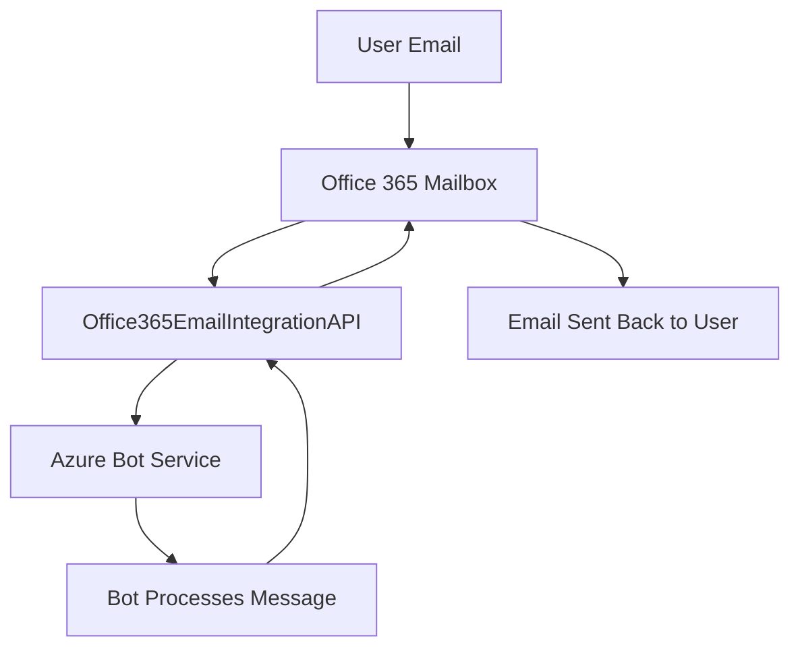

---

# Email Channel Integration with Azure Bot Service (R\&D)

This repository contains a **Proof of Concept (PoC)** project exploring how to integrate **email as a communication channel** for bots built on the **Azure Bot Service**. The project demonstrates sending and receiving messages through **Office 365 email accounts** using the **Microsoft Graph API**, the **Bot Framework SDK**, and **Azure Functions**.

## 📌 Project Overview

Traditionally, Azure Bot Service supports channels like Microsoft Teams, Slack, or Web Chat. This project extends that capability to **email**, allowing users to interact with a bot directly from their inbox.

✅ **Receive emails** and pass them to the bot for processing
✅ **Send bot responses back as emails** to the user
✅ Uses **Office 365 API & Microsoft Graph** for email integration
✅ Built as a **.NET solution** with separate **Bot Service** and **API project**

This is currently an **R\&D prototype (PoC)**, but future work will involve upgrading to the **latest .NET version** and adding **Generative AI** features for smarter, context-aware email responses.

---

## 🏗️ Repository Structure

* **`Office365EmailIntegrationBot.sln`** → Solution file
* **`O365EmailIntegrationBot/`** → Azure Bot Service project
* **`Office365EmailIntegrationAPI/`** → API project for handling Office 365 email integration

---

## ⚙️ Prerequisites

Before running the project, ensure you have:

* [Azure Subscription](https://azure.microsoft.com/)
* [.NET SDK 2.1](https://dotnet.microsoft.com/en-us/download/dotnet/2.1) (planned upgrade to latest in future)
* Office 365 account with **Graph API access**
* Azure Bot Service setup (via [Bot Framework](https://dev.botframework.com/))

---

## 🔑 Azure App Registration Setup (Required)

To enable the API to access emails from Office 365 using Microsoft Graph:

1. **Register an App in Azure AD**

   * Go to [Azure Portal → App Registrations](https://portal.azure.com/#view/Microsoft_AAD_RegisteredApps/ApplicationsListBlade).
   * Click **New Registration**.
   * Name: `EmailBotIntegration` (or your choice).
   * Supported account type: *Single tenant* (or multi-tenant if needed).
   * Redirect URI: `https://localhost` (or your deployed API URL).

2. **Collect App Credentials**

   * After registration, note down:

     * **Application (client) ID**
     * **Directory (tenant) ID**
   * Under **Certificates & secrets**, create a **Client Secret** and save it securely.

3. **Assign Microsoft Graph API Permissions**

   * Navigate to **API Permissions → Add a permission → Microsoft Graph**.
   * Add the following **delegated permissions**:

     * `Mail.Read` → Read user emails
     * `Mail.Send` → Send emails
     * `User.Read` → Sign in and read user profile
   * Click **Grant admin consent**.

4. **Configure Environment Variables**

   * In your API project, set these values (via `appsettings.json` or environment variables):

     ```json
     {
       "AzureAd": {
         "TenantId": "<YOUR_TENANT_ID>",
         "ClientId": "<YOUR_CLIENT_ID>",
         "ClientSecret": "<YOUR_CLIENT_SECRET>"
       },
       "EmailSettings": {
         "MailboxAddress": "<YOUR_OFFICE365_EMAIL>"
       }
     }
     ```

---

## 🚀 Setup & Installation

1. **Clone the repository**

   ```bash
   git clone https://github.com/AbhishekHumagain/EmailChannelIntegrationAzureBotServiceR-D.git
   cd EmailChannelIntegrationAzureBotServiceR-D
   ```

2. **Open the solution**

   ```bash
   dotnet build Office365EmailIntegrationBot.sln
   ```

3. **Run locally**

   ```bash
   dotnet run --project O365EmailIntegrationBot
   ```

4. **Deploy to Azure**

   * Deploy the API and bot service separately.
   * Configure the email webhook to point to the API endpoint.
   * Register the bot channel in the Azure portal.

---

## 📬 Usage Flow

### ASCII Flow

```
User Email
    |
    v
Office 365 Mailbox
    |
    v
[Office365EmailIntegrationAPI]
    |
    v
[Azure Bot Service (O365EmailIntegrationBot)]
    |
    v
Bot Processes Message
    |
    v
[Office365EmailIntegrationAPI]
    |
    v
Email Sent Back to User
```

### Mermaid Flow (renders automatically on GitHub)



---

## 🛠️ Tech Stack

* **.NET Core 2.1** (planned upgrade)
* **Azure Bot Service**
* **Microsoft Bot Framework SDK**
* **Azure Functions**
* **Office 365 / Microsoft Graph API**

---

## 📅 Project Status

This is an **R\&D PoC** and not production-ready. Future roadmap includes:

* 🔄 Upgrade to the **latest .NET SDK**
* 🤖 Implement **Generative AI** (LLMs) for intelligent email responses
* ⚡ Optimize integration with Azure Functions

---

## 🤝 Contributing

Contributions are welcome! If you’d like to improve this project (e.g., migrate to .NET 8, add AI features, or enhance email workflows), please fork the repo and submit a pull request.

---

## 📜 License

This project is currently unlicensed. You are free to explore, but for production use, please clarify licensing terms.

---

## 👤 Author

**Abhishek Humagain**

* Senior Software Engineer & Team Lead
* [GitHub Profile](https://github.com/AbhishekHumagain)

---
